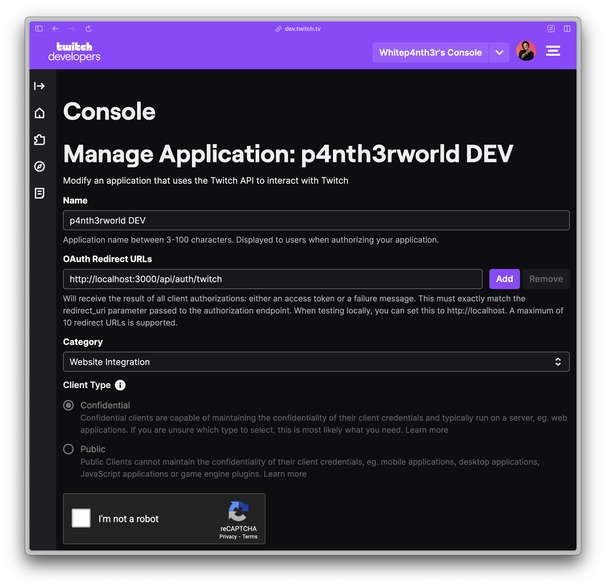

[](https://app.netlify.com/sites/pantherworld/deploys)

# Welcome to p4nth3r.world

## The game doesn't stop when the stream ends

p4nth3rworld is a multiplayer text-based game powered by a live coding stream at
[twitch.tv/whitep4nth3r](twitch.tv/whitep4nth3r).

[Learn how to play the game](https://p4nth3r.world/manual)

## About this repository

This project is the frontend companion app for p4nth3rworld, offering players an opportunity to:

- view their inventory of items
- view (evolving) metadata about the game and the world
- and more (eventually!)

The game is powered by the p4nth3rb0t-mainframe backend, which also provides the APIs for game data for this project.
**The backend is closed-source**.

Any bugs you find or features you wish to see implemented in p4nth3rworld can be submitted as
[issues in this repository](https://github.com/whitep4nth3r/pantherworld/issues).

This is a community project built using Nuxt and Tailwind. To get involved, contribute by submitting feature requests,
bugs, or by submitting pull requests for _existing issues_.

## Project setup

Clone the repo, and install dependencies. For a seamless experience (and to avoid committing other lock files to the
repo), please use `pnpm`.

```bash
pnpm install
```

### Environment variables

The inventory view is behind authentication, which is powered by your Twitch login. You'll need three environment
variables to enable authentication when running the app locally.

```text
NUXT_OAUTH_TWITCH_CLIENT_ID=
NUXT_OAUTH_TWITCH_CLIENT_SECRET=
NUXT_SESSION_PASSWORD=
```

1. Copy the `.env.example` file provided to the root of the project, and change the name of the file to `.env`.
1. Go to the [Twitch Developer Console](https://dev.twitch.tv/console), log in via Twitch, and create a new app.
1. Name your app something meaningful, like `p4nth3rworld DEV`.
1. Add the following OAuth Redirect URL: `http://localhost:3000/api/auth/twitch`
1. Copy the provided Client ID and paste into your env file as the value for `NUXT_OAUTH_TWITCH_CLIENT_ID`
1. Generate a new Client Secret (remember to tick "I'm not a robot"), and paste into your env file as the value for
   `NUXT_OAUTH_TWITCH_CLIENT_SECRET`
1. Generate a random string (less than 32 characters) and paste into your env file as the value for
   `NUXT_SESSION_PASSWORD`



### Development Server

Start the development server on `http://localhost:3000`:

```bash
pnpm run dev
```

## More about Nuxt

Look at the [Nuxt 3 documentation](https://nuxt.com/docs/getting-started/introduction) to learn more.
